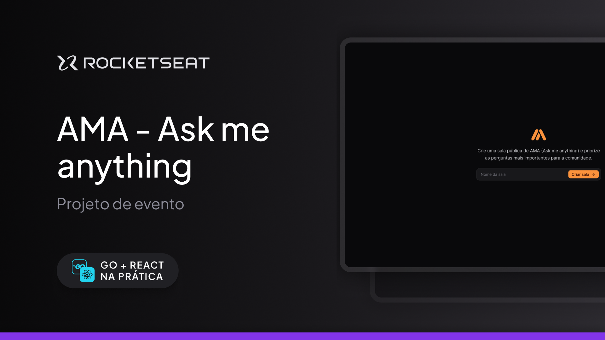

  <h1 align="center">Evento Go + React - Trilha ReactJS</h1>

  
  
  
  
  
  
  

  <a href="#tecnologias">Tecnologias</a> •
  <a href="#projeto">Projeto</a> •
  <a href="#layout">Layout</a> •  
  <a href="#licenca">Licença</a>

  

## 💻 Projeto

Projeto de um site de criação de perguntas com funcionalidades como criação de salas e reação à perguntas desenvolvido durante o evento "GO + React" da Rocketseat na Trilha ReactJS.

## 🚀 Tecnologias

Esse projeto foi desenvolvido com as seguintes tecnologias:

- ReactJS
- Vite
- Typescript
- Tailwind CSS
- React Router Dom
- React Tanstack Query
- Figma

## 🔖 Layout

Você pode visualizar o layout do projeto através [desse link](https://www.figma.com/community/file/1402302237126862071).

## 📝 Licença

Esse projeto está sob a licença MIT.
